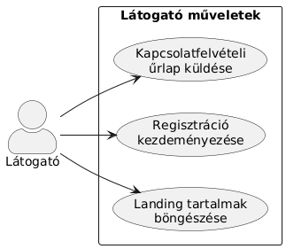
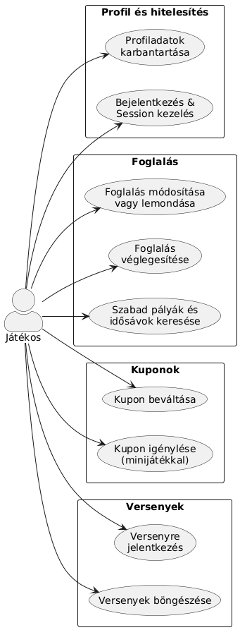
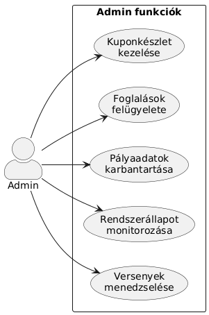

# Rendszerterv

## 1. Cél és hatókör
A dokumentum a teniszpálya-foglaló rendszer megvalósítási nézőpontját rögzíti. A cél, hogy a funkcionális specifikációban szereplő igényeket úgy valósítsuk meg, hogy közben áttekinthető legyen az architektúra, a komponensek közötti felelősségmegosztás és az üzemeltetési elvárás. A fő szereplők: vendég (regisztráció nélkül böngészhet), regisztrált játékos (foglalhat, tornára jelentkezhet), adminisztrátor (árképzés, pályák, tornák kezelése), valamint a Google Calendar külső szolgáltatás.

## 2. Rendszerkörnyezet és kontextus
- **Kapcsolati modell:** Felhasználók → React alapú single-page alkalmazás → ASP.NET Core REST API → SQLite adatbázis. A backend szükség szerint kommunikál a Google Calendar API-val és opcionális e-mail szolgáltatásokkal.
- **Kommunikáció:** HTTPS + REST/JSON. A felhasználók JWT tokennel hitelesítik magukat, CORS engedélyezi a frontend domainről érkező kéréseket.
- **Infrastruktúra:** Fejlesztésnél minden komponens lokálisan fut. Teszt/éles környezetben a frontend buildet statikus fájlkiszolgáló (pl. nginx) szolgálhatja ki, az API konténerizálva fut, az adatbázis dedikált szerveren vagy szolgáltatásban található.

## 3. Architektúra áttekintése
### 3.1 Rétegek
1. **Kliens réteg (`frontend/`):** React + Vite SPA, Tailwind komponensek, React Router. Hitelesített/nyilvános útvonalak, állapotkezelés (Context/Query) a felhasználói adatokhoz.
2. **Szolgáltatás réteg (`API/Teniszpalya.API/`):** ASP.NET Core Web API, ahol a kontrollerek végzik a kérések fogadását, a szolgáltatás réteg (pl. `ReservationService`) tartalmazza az üzleti logikát.
3. **Adat réteg:** EF Core alapú repository az `AppDbContext`-en keresztül. Fejlesztésben SQLite, éles környezetben ajánlott PostgreSQL vagy SQL Server a konkurens írásokhoz.

### 3.2 Fő komponensek
- **Authentikáció:** `AuthController`, `IdentityService`, JWT generálás, jelszóhash (PBKDF2/BCrypt).
- **Foglalás:** `ReservationController`, `ReservationService`, `CalendarSyncService` (Google Calendar integráció), konkurens foglalások ellenőrzése tranzakciókkal.
- **Árlista és pályakezelés:** `PricingController`, `CourtController` + `PricingService` a dinamikus árképzési szabályokra (idősáv, pálya típusa).
- **Tornák és események:** `TournamentsController`, `TournamentService` (nevezések kezelése, sorsolás előkészítése).

## 4. Logikai komponensmodell
- **Entitások:** `User`, `Role`, `Court`, `Reservation`, `Tournament`, `TournamentEntry`, `PricingRule`, `OpeningHour`, `Invoice` (tervezett). A kapcsolatok többsége egy-több (pl. `User`–`Reservation`).
- **DTO-k:** külön input/output modellek (`ReservationRequestDto`, `ReservationResponseDto`) biztosítják, hogy a kliens csak a szükséges mezőket lássa.
- **Validáció:** DataAnnotations + FluentValidation. Kulcsszabályok: időintervallum ütközés, érvényes pályaazonosító, szerepkörhöz kötött mezők.

## 5. Adatmenedzsment
- **Séma:** EF Core migrációk versionálják a táblákat. Elsődleges kulcs minden táblában `Id`. Indexek: `Reservations` táblában (`CourtId`, `StartTime`), `Users` táblában (`Email`).
- **Seedelés:** Alap admin felhasználó, minta pályák, árak, teszt tornák. A seed fut a migrációk után.
- **Tranzakciók:** Foglalásnál `Serializable` izoláció vagy EF Core `ExecutionStrategy` használata, hogy ugyanarra az idősávra ne kerülhessen két rekord.
- **Adattisztaság:** Soft delete jelölők a történeti adatokhoz; automatikus státuszváltás lejárt foglalásoknál background jobból (Hangfire/Quartz opcionális).

## 6. Folyamatnézetek
### 6.1 Foglalás létrehozása
1. Felhasználó kiválasztja a pályát és idősávot a frontend felületen.
2. SPA POST kérést küld `/api/reservations` végpontra JWT-vel.
3. API validálja a kérést, ellenőrzi az ütközéseket, majd EF Core tranzakcióval létrehozza a rekordot.
4. `CalendarSyncService` opcionálisan felveszi az eseményt Google Calendarba.
5. API 201-es választ ad, a frontend frissíti a naptárnézetet.

### 6.2 Admin árlista módosítás
1. Admin a kezelőfelületen módosítja az időszakot és árat.
2. PUT `/api/pricing/{id}` hívás indul, szerepkör ellenőrzéssel.
3. Szolgáltatás réteg frissíti a `PricingRule` entitást, invalidálja a cache-t (ha van), eseményt logol.
4. A következő kereséseknél az új ár érvényesül.

### 6.3 Google Calendar szinkron
1. Szolgáltatás ütemezetten (pl. 5 percenként) végignézi a módosított foglalásokat.
2. `CalendarSyncService` OAuth tokennel hívja a Calendar API-t.
3. Hibák esetén visszatartja a státuszt és logolja az incidenst.

> A folyamatok sequence-diagramjai a `static/img/usecase.png` és `static/img/class_diagram.png` ábrák leírását egészítik ki.

## 7. Telepítési és futtatási architektúra
- **Fejlesztés:** `frontend` (Vite dev szerver 5173-as port), `API` (HTTPS 5001), SQLite fájl `API/Teniszpalya.Infrastructure/app.db`.
- **Teszt:** konténerizált API (Dockerfile), külön álló SQLite/ PostgreSQL, CI pipeline futtatja a teszteket.
- **Éles:** SPA build statikus tárhelyen, API több replika + load balancer, adatbázis felügyelt szolgáltatás. Az API stateless, így horizontálisan skálázható.
- **Migrációk:** deployment előtt `dotnet ef database update`. Rollbackhez verziózott migrációk és DB backup szükséges.

## 8. Külső integrációk
- **Google Calendar:** Szolgáltatásfiók vagy OAuth 2.0 hitelesítés, `Calendar.Events.insert/update/delete` hívások. Hibakezelés exponential backoff-fal, audit log.
- **E-mail értesítések (tervezett):** SMTP/SendGrid integráció `NotificationService`-szel, foglalási visszaigazolás és emlékeztetők küldése.

## 9. Biztonság és jogosultság
- **Hitelesítés:** JWT access token (15-30 perc), refresh token (7 nap). Tokenben szerepkör (`role` claim) és felhasználói azonosító (`sub`).
- **Autorizáció:** ASP.NET Core policy-k: `AdminOnly`, `ReservationOwnerOrAdmin`. Kritikus végpontoknál explicit ellenőrzés.
- **Jelszótárolás:** BCrypt/PBKDF2, sózással. Kötelező HTTPS és HSTS.
- **Védelem:** Rate limiting (pl. ASP.NET Core limiter), input sanitization, Serilog request logging, érzékeny adatok maszkolása logokban.

## 10. Üzemeltetés, monitorozás, hibakezelés
- **Logolás:** Serilog struktúrált logok (JSON), korrelációs azonosítóval. Fontos események: foglalások, fizetési kísérletek, külső API hibák.
- **Monitorozás:** Health Check endpoint (`/health`), metrikák (CPU, memória, foglalásszám). Integráció Prometheus/Grafana vagy Application Insights felé.
- **Mentések:** Napi adatbázis backup, hetente teljes snapshot. Adatvédelmi előírások szerinti megőrzés.
- **Vészhelyzet:** DR terv: újra deploy konténerből, DB restore legfeljebb 1 órás RPO/RTO céllal.

## 11. Mellékletek és hivatkozások
- Funkcióspecifikáció: `docs/funkspec.md`
- Követelmény specifikáció: `docs/kovspec.md`
### Use case ábra:

#### Visitor

#### Player

#### Admin

### Class diagram:

### Adatbázis terv: 
