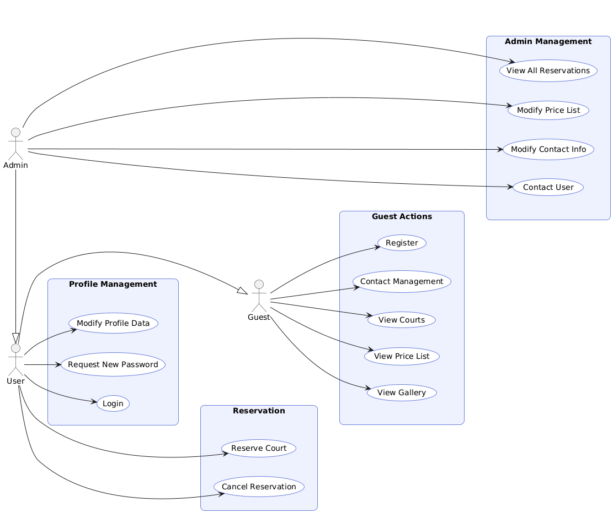
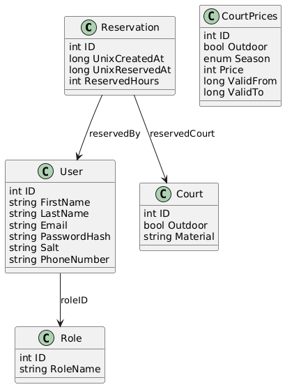
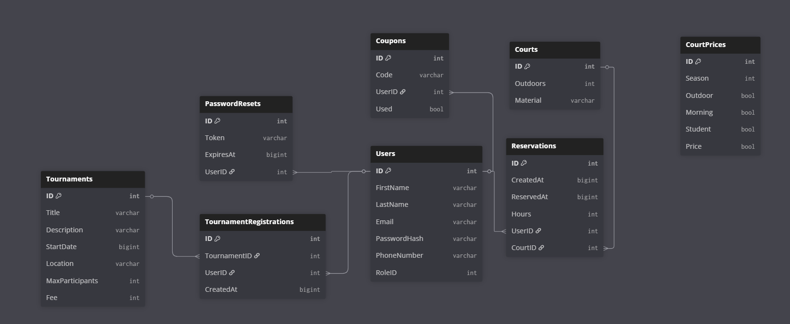

# Usecase ábra

# User stories
1. János bácsi beszélgetett barátjával Sanyi bácsival, hogy milyen jó is voltak a régi szép idők, amikor régen teniszeztek. János bácsinak támadt egy ötlete: elhívja Sanyi bácsit teniszezni egyet. Felnézett így az oldalra, megnézte, hogy milyen elérhető pályák vannak, milyen árban. Képeket is nézett a helyről, de sajnos számára már túl drága az efféle mulatság, így elmondta unokájának, Kálmánnak. 

    **Kapcsolódó funkció:** `F04, F05, F06`

2. Kálmán elmondta a barátainak, hogy milyen jó teniszpályákat talált nagypapája, és Mátyás barátjával akartak menni következő héten. Mindketten felnéztek az oldalra, és Kálmán regisztrált magának egy saját fiókot, hogy a közeljövőben tudjon pályát foglalni. Készített egy fiókot barátjának, Mátyásnak is. Mátyás megkapta a fiókját, de mint kiderült Kálmán elírta a nevét, így azt módosítania kellett 

    **Kapcsolódó funkció:** `F01, F15`

3. Miután elkészítette Mátyásnak is a fiókját, be szeretett volna lépni a sajátjába. De sajnos már addigra elfelejtette a jelszavát, ezért rákattintott az "Elfelejtettem a jelszavam" lehetőségre. Megadta az e-mail címét, és beállított egy új jelszót a fiókjához. Ezúttal felírta magának a jelszót, elmondta Mátyásnak, hogy ő is írja fel, nehogy úgy járjon mint ő. 

    **Kapcsolódó funkció:** `F02, F03`

4. Szép nyári időszak volt akkor, és úgy döntöttek, hogy hétvégére foglalnak maguknak egy teniszpályát. Kálmán belépett, kiválaszotta mikor és melyik pályán szeretne játszani, és lefoglalt magának egy időpontot. Erről kapott egy e-mailt, és ezt az e-mailt elküldte barátjának, Mátyásnak. 

    **Kapcsolódó funkció:** `F07, F13`

5. Szombatra foglalták a pályát, de csütörtökön írt Mátyás Kálmánnak, hogy megfázott, így sajnos nem jó neki a hétvégi teniszezés. Kálmán szomorúan fogadta az információt, és lemondta az akkori időpontjukat. Viszont jövőhéten foglalt egy újabb időpontot. 

    **Kapcsolódó funkció:** `F08`

6. Mint kiderült, ennek az oldalnak az üzemeltetője nem más, mint Sanyi bácsi. Fellépett weboldalának az admin felületére, és észrevette, hogy János bácsi unokája, Kálmán, foglalt időpontot a teniszpályárája. Nagyon megörült neki, felhívta János bácsit elújságolni a hírt. Ezután az admin felületen keresztül írt egy levelet Kálmánnak, hogy sok szeretettel várja őket a teniszpályán. 

    **Kapcsolódó funkció:** `F10, F16`

7. Kálmán nagy örömmel fogadta a hírt, ezért fel szerette volna hívni Sanyi bácsit. De sajnos nem tudta a telefonszámát, ezért a kapcsolatfelvételi lapon azt megnézte, és felhívta Sanyi bácsit. Viszont Sanyi bácsi helyett, egy "A hívószám nem elérhető" hangot hallotta a telefonban. Mint kiderült, Sanyi bácsi elírta a telefonszámát. Így Kálmán írt neki egy válasz e-mailt, ahol leírta neki a pontatlanságot. Sanyi bácsi ezután egyből módosította a kapcsolati adatait a weboldalon. 

    **Kapcsolódó funkció:** `F09, F12`

8. Teltek a napok, Kálmán már nagyon várta a teniszezést Mátyással. Egy nappal előtte Kálmán kapott egy értesítő e-mailt, amiben látta a foglalását. Másnap elmentek teniszeztek egy jót és ezután elmentek moziba. Sanyi bácsi nagyon megörült, hogy fiatalok is használják a teniszpályáit, így kicsit csökkentette a foglalás árát, hogy mindenkinek elérhető legyen a teniszezés. 

    **Kapcsolódó funkció:** `F11, F14`

9. Azóta Kálmánék nagyon sokat teniszeztek együtt, kiváncsi is volt, hogy hányszor. Így belépett a fiókjába, és kiderült, már több mint 10-szer teniszeztek a nyáron. 

    **Kapcsolódó funkció:** `F17`

# Class diagram

# Adatbázis terv
